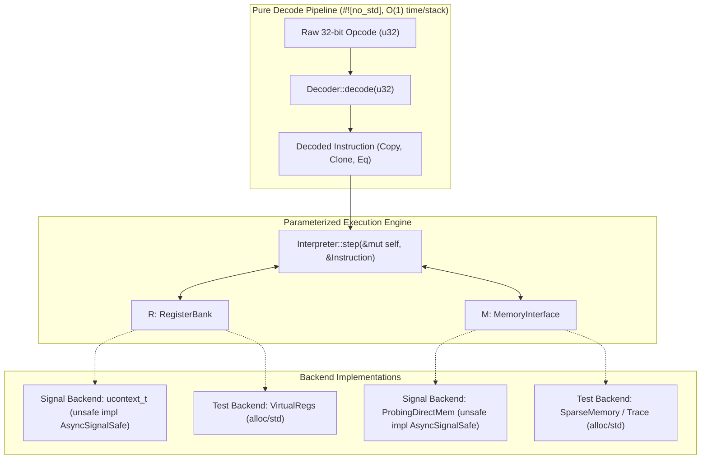

# sigstep-a64

> A `no_std` ARM64 instruction decoder and interpreter parameterized over register and memory semantics, with compile-time async-signal-safety guarantees.

[](#license)
[](#layering-and-features)
[](#supported-targets)

---

## Overview

`sigstep-a64` provides an embeddable, high-assurance ARM64 (AArch64) instruction decoder and execution engine. It is designed specifically for runtime systems, user-space trap-and-emulate monitors, software breakpoints, and low-level debugging frameworks that execute inside **POSIX signal handlers** (such as `SIGILL`, `SIGTRAP`, and `SIGSEGV`) where standard runtime routines, dynamic memory allocation, and mutex synchronization are illegal.

Rather than coupling the execution engine to a fixed machine context or physical memory space, `sigstep-a64` parameterizes instruction interpretation over two foundational abstractions:
1. `RegisterBank`: Accessor interface for architectural state ($X0$–$X30$, $SP$, $PC$, $PSTATE.NZCV$, and optional SIMD/FP vectors).
2. `MemoryInterface`: Accessor interface for address spaces, providing byte/word operations, alignment checking, and atomic primitives.

```rust
pub struct Interpreter<R: RegisterBank, M: MemoryInterface> {
    pub regs: R,
    pub mem: M,
}
```

When both the supplied register bank and memory interface implement the unsafe marker trait `AsyncSignalSafe`, the composite `Interpreter<R, M>` automatically satisfies `AsyncSignalSafe`.

---

## Architectural Separation

The engine enforces a strict pipeline separation: instruction bytes are first decoded into immutable, compact descriptors, which are subsequently interpreted against pluggable backends.



---

## Async-Signal Safety Invariant

Executing code inside POSIX signal handlers presents severe reentrancy hazards:
- **Heap Corruption:** Invoking the global memory allocator (`malloc`, `alloc`, `Box`, `Vec`) while an interrupted thread holds an internal allocator lock triggers immediate deadlock or heap corruption.
- **Deadlock on Locks:** Thread synchronization primitives (mutexes, rwlocks, non-recursive spinlocks) will deadlock if the thread interrupted by the signal was already holding the lock.
- **Stack Exhaustion:** Signal handlers frequently run on alternate signal stacks (`sigaltstack`) with strict bounded capacities (e.g., `SIGSTKSZ`, typically 8KB to 64KB). Unbounded recursion or large stack allocations cause fatal stack overflows.

`sigstep-a64` eliminates these failure modes at compile time using an `unsafe` marker trait contract:

```rust
/// Marker trait guaranteeing that all operations exposed by the implementor
/// are reentrant, non-blocking, non-allocating, and safe to call from
/// asynchronous signal handlers (e.g., SIGILL, SIGTRAP, SIGSEGV).
pub unsafe trait AsyncSignalSafe {}

// Blanket induction: Interpreter is signal-safe if and only if
// all underlying abstractions are signal-safe.
unsafe impl<R, M> AsyncSignalSafe for Interpreter<R, M>
where
    R: RegisterBank + AsyncSignalSafe,
    M: MemoryInterface + AsyncSignalSafe,
{}
```

By adding a `where Interpreter<R, M>: AsyncSignalSafe` bound to signal handler entrypoints, any accidental usage of heap-backed memory mockers or non-reentrant tracing backends is caught at **compile time**.

---

## Layering and Features

The crate is organized into minimal layers to maximize portability and verifiability:

| Feature | Default | Description |
| :--- | :--- | :--- |
| `std` | **Yes** | Enables standard library integration, formatting helpers, and standard test runners. |
| `alloc` | No | Enables heap-backed memory models, rich instruction tracing, and AST-like disassembler views. |
| `signal` | No | Exposes Linux / POSIX `ucontext_t` register view and direct safe-probing memory backend via `libc` (`default-features = false`). |

To use `sigstep-a64` in bare-metal environments or `#![no_std]` runtimes:

```toml
[dependencies.sigstep-a64]
version = "0.1"
default-features = false
```

For signal-handling instrumentation on Linux AArch64:

```toml
[dependencies.sigstep-a64]
version = "0.1"
default-features = false
features = ["signal"]
```

---

## Usage Example

The following example illustrates how the parameterized interpreter can be invoked inside a signal handler with static safety verification:

```rust
use sigstep_a64::{
    AsyncSignalSafe, DecodeError, Decoder, ExecError, Interpreter,
    MemoryInterface, RegisterBank,
};

/// A signal handler routine verified at compile-time to be reentrant.
pub fn handle_step<R, M>(interp: &mut Interpreter<R, M>) -> Result<(), ExecError>
where
    R: RegisterBank + AsyncSignalSafe,
    M: MemoryInterface + AsyncSignalSafe,
    Interpreter<R, M>: AsyncSignalSafe,
{
    // 1. Fetch current PC from register bank
    let pc = interp.regs.get_pc();

    // 2. Fetch raw 32-bit instruction from memory
    let raw_inst = interp.mem.read_u32(pc)?;

    // 3. Decode instruction (O(1) stack, zero allocations)
    let inst = Decoder::decode(raw_inst).map_err(ExecError::Decode)?;

    // 4. Emulate single instruction step
    interp.step(&inst)
}
```

---

## Repository Structure

```text
├── .agents/
│   └── rules/
│       ├── signal-safety.md           # Mandatory rules for signal safety and reentrancy
│       └── coding-style.md            # Idiomatic #![no_std] standards and Arm spec citations
├── docs/
│   └── arch/
│       ├── register-representation.md # Physical RegId vs decoded Gpr, zero-extending accessors
│       ├── traits-and-safety.md       # Interface specifications for RegisterBank & MemoryInterface
│       └── instruction-matrix.md      # Phased ISA implementation roadmap and opcode reference
├── src/                               # Core engine (to be implemented)
└── README.md
```

---

## Supported Targets

- `aarch64-unknown-none` (Bare-metal / firmware / kernel)
- `aarch64-unknown-linux-gnu` / `aarch64-unknown-linux-musl` (Linux user-space signal handling)
- `aarch64-apple-darwin` (macOS / iOS user-space)

---

## License

Dual-licensed under either of:
- Apache License, Version 2.0 ([LICENSE-APACHE](LICENSE-APACHE))
- MIT License ([LICENSE-MIT](LICENSE-MIT))

at your option.
